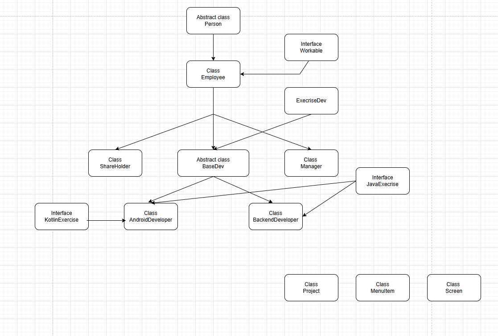

# SummayTask12 

Dự án tổng hợp kiến thức task 1 và task 2, tập trung vào việc học và thực hành lập trình Kotlin với các khái niệm về OOP, Coroutines và quản lý dữ liệu. Dự án bao gồm cả ứng dụng Android cơ bản và các chương trình console để thực hành.

## Tính năng chính

### Quản lý đối tượng Person và các lớp con
- Thêm và quản lý nhân viên
- Thêm và quản lý Android Developer với level tự động (Intern, Fresher, Junior, Senior)
- Thêm và quản lý sinh viên với thông tin GPA và xếp loại học lực
- Tạo công ty startup với thông tin founder

### Chức năng tìm kiếm và thống kê
- Tìm kiếm nhân viên theo tên
- Lọc nhân viên theo phòng ban  
- Thống kê tổng số nhân viên, Android developer
- Hiển thị danh sách Android developer theo level

### Demo hiệu năng và Coroutines
- So sánh hiệu năng giữa MutableSet và HashSet
- Thực hành Kotlin Coroutines với async/await
- Đo thời gian thực thi các thao tác khác nhau

## Công nghệ sử dụng

- Kotlin 1.9.24
- Android SDK API 28+
- Kotlin Coroutines
- Gradle build system

## Cấu trúc dự án

```
app/src/main/java/com/eco/summaytask12/
├── data/
│   ├── DataRepository.kt          # Quản lý dữ liệu mock
│   └── model/                     # Các class model
│       ├── Person.kt              # Base class
│       ├── Employee.kt            # Kế thừa Person
│       ├── AndroidDeveloper.kt    # Kế thừa Employee
│       ├── Student.kt             # Kế thừa Person
│       ├── Company.kt             # Quản lý công ty
│       ├── Founder.kt             # Kế thừa Person
│       └── các enum (Gender, DeveloperLevel, DegreeType)
├── extension/
│   └── StringExt.kt               # Extension cho String
├── MainActivity.kt                # Activity Android cơ bản
├── Main1.kt                       # Demo coroutines và performance test
└── Main2.kt                       # Console app với menu
```

## Hướng dẫn chạy

### Yêu cầu
- Android Studio
- JDK 11+
- Android SDK API 28+

### Cài đặt
1. Mở project trong Android Studio
2. Sync Gradle
3. Chạy Main1.kt hoặc Main2.kt để test console application
4. Chạy ứng dụng Android để xem MainActivity

## Cách sử dụng

### Console Application (Main2.kt)
Chạy file Main2.kt để truy cập menu:

```
Nhập 1 để thực hiện thêm nhân viên
Nhập 2 để thực hiện tìm kiếm nhân viên theo tên  
Nhập 3 để thực hiện in ra danh sách thông tin nhân viên
Nhập 4 để thực hiện in ra danh sách nhân viên theo phòng ban
Nhập 5 để thực hiện in ra thống kê báo cáo nhân viên
Nhập 6 để thực hiện in ra danh sách thông tin Android dev theo level
Nhập 7 để thực hiện thêm Android developer
Nhập 8 để thực hiện tạo sinh viên và thêm sinh viên vào danh sách
Nhập 9 để thực hiện tạo company và thêm company vào cơ sở dữ liệu
Nhập 0 để quay lại
```

### Performance Demo (Main1.kt)
Chạy file Main1.kt để xem demo:
- Sử dụng Kotlin Coroutines với async/await
- So sánh hiệu năng MutableSet vs HashSet
- Đo thời gian tìm kiếm và thêm dữ liệu với 100,000+ records

## Kiến trúc và patterns sử dụng

### Object-Oriented Programming
Dự án sử dụng inheritance hierarchy:
```
Person (base class)
├── Employee
│   └── AndroidDeveloper
├── Student  
└── Founder
```

### Repository Pattern
DataRepository quản lý dữ liệu mock và các thao tác CRUD cơ bản.

### Kotlin Features
- Extension functions: StringExt.kt cho việc convert string sang enum
- Data classes: Company, các enum classes
- Coroutines: async/await cho xử lý bất đồng bộ
- Collections: So sánh MutableSet vs HashSet

## Các tính năng học tập

### Performance Testing
- So sánh MutableSet vs HashSet với 100,000+ records
- Đo thời gian addStudent1() vs addStudent2()
- Test searchStudent1() vs searchStudent2()
- Kiểm tra hiệu năng checkContainStudent1() vs checkContainStudent2()

### Input Validation
Các hàm helper:
- readlnOrNull(): Không cho phép input rỗng
- readlnOrNullDouble(): Validate số thực
- readlnOrNullFloat(): Validate số float



## Tác giả

Dự án học tập về Kotlin và Android Development
Email: phucth.ecomobile@gmail.com

