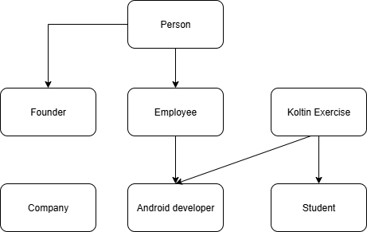

# SummayTask12

Tổng hợp kiến thức task1 và task2  

Chương trình giả lập việc thêm, sửa, xóa dữ liệu liên quản lý các đối tượng trong công ty  

Sử dụng coroutine thực hiện add Employee, get thông tin lấy ra danh sách các nhân viên, lọc và tìm kiếm thông tin theo thuộc tính Employee và Android Developer.

Main1: dung de gia lap viec get them du lieu su dung coroutine  
Main2: chuong trinh thuc hin cac chuc nang:  

Nhập 1 để thực hiện thêm nhân viên  
Nhập 2 để thực hiện tìm kiếm nhân viên theo tên  
Nhập 3 để thực hiện in ra danh sách thông tin nhân viên  
Nhập 4 để thực hiện in ra danh sách nhân viên theo phòng ban  
Nhập 5 để thực hiện in ra thống kê báo cáo nhân viên  
Nhập 6 để thực hiện in ra danh sách thông tin Android dev theo level  
Nhập 7 để thực hiện thêm Android developer.  
Nhập 0 để quay lại.  

